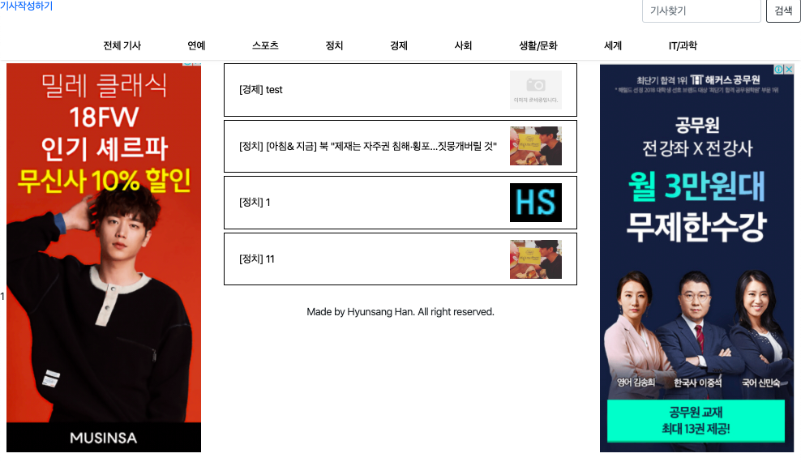

# 뉴스플랫폼 구현

### 기획 의도
- `News`는 '새로운 소식'이라는 뜻입니다. 하지만 뉴스기사는 기자들만 쓸 수 있죠. 기자가 아니어도 새로운 소식을 전하고 싶을 때가 있습니다. 뉴스 기사의 형태로 웹을 통해 새로운 소식을 전할 수 있도록, 뉴스플랫폼이자 UGC플랫폼을 만들고자 했습니다.
- 궁극적으로는, 가짜뉴스를 양지화합니다.

### 사용 예시
- 친구의 취업 소식을 뉴스 기사처럼 포멀한 형태로 작성해서 다른 친구들에게 공유
- 만우절 장난으로 남북통일 뉴스 공유

### UI
